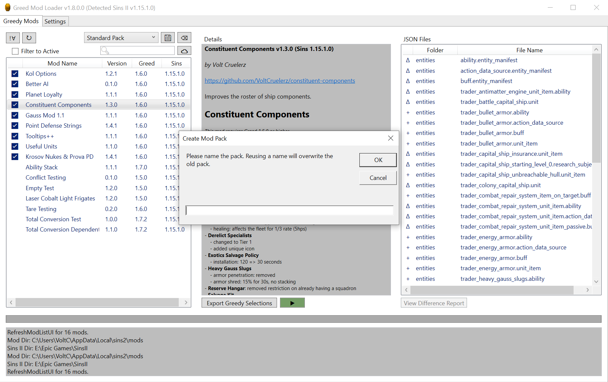

# The Greed Mod Manager

_A mod deconfliction tool for [Sins of a Solar Empire II](https://www.sinsofasolarempire2.com/)_

[Github](https://github.com/VoltCruelerz/Greed) [Forum](https://forums.sinsofasolarempire2.com/522050/page/1)



## Installation

1. Download `Greed.zip` from the [latest github release](https://github.com/VoltCruelerz/Greed/releases)
2. Extract the file wherever you please on your machine.
3. Run `Greed.exe`
4. Set the directories on the Settings tab. They will autosave if the paths exist.
    1. **Sins Directory** should be the location of Sins II's exe. (eg `E:\Epic Games\SinsII`)
    2. **Mods Directory** should be the location of the mod folder. (eg `C:\Users\VoltC\AppData\Local\sins2\mods`)
5. In the main tab, you'll find a list of Greed-compatible mods to the left, which you can activate or deactivate as you wish either with the button or double-clicking.
6. When you have the mods activated that you want, click `[Export Greedy Selections]`.

## For Mod Developers

First, some definitions:

- **Gold Files**: the gold copy, which is the original Sins II data files. These are _never_ changed by Greed.
- **Source Files**: the files from the individual greedy mods.
- **Greed Files**: the files that are going into the greed mod folder. When Greed activates a list of mods, it initializes any relevant greed files from gold copies and then successively applies the edits of each mod in the list, ultimately producing an execution product.

### Why Use Greed?

- **Comments**: You can add C-style comments to your source files.
- **Selective Inclusion**: Your mod only needs to include what you changed about a particular source file (eg add a new property, delete a property, or add an array element), _drastically_ reducing the risk of collisions between mods.
- **Intelligent Merge**: Intelligent merging of localization files.
- **File Diff**: Greed ships with a diff tool specifically for Sins II data files, allowing you to readily see exactly what you've done.
- **[TODO] Automated Updates**: Users will be able to update the latest version of your mod with a single click.
- **[TODO] Dependency Management**: Users will be able to automatically install your mod's dependencies.
- **[TODO] Conflict Detection**: Users will be alerted when they attempt to enable known conflicting mods.


### Greed Compatibility

To make a mod compatible with Greed, you need only add a `greed.json` file to your mod's folder, as seen below.

```json
{
    "name": "Point Defense Strings",
    "author": "Volt Cruelerz",
    "url": "https://github.com/VoltCruelerz/pd-strings",
    "description": "Blurb goes here.",
    "version": "1.0.0",
    "sinsVersion": "1.14.3.0",
    "greedVersion": "1.4.0",
    "dependencies": [],
    "conflicts": [],
    "priority": 100
}
```

### Merge Types

The ultimate goal of Greed is to allow multiple mods to gracefully integrate together so that we can release smaller, more targeted mods, rather than these massive bundles that nobody really knows what's inside them. To facilitate this, Greed acts as the ultimate arbiter, compiling greedy mods into a single "mod" in the mods directory which is then listed as active for Sins II to read from.

Ideally, a mod should change **_as little as it can_** to have its desired effect so that multiple mods could even modify the same file.

#### Greed Merge Types

To that end, Greed introduces several json file extensions that allow targeted edits within a given file. For example, if you want to edit the Kol, you might name your file `trader_battle_capital_ship.unit.gmr`.

- `.gmr` **(Greed Merge Replace)**: for each element in the the mod file's arrays, it replaces the greed file's corresponding element at that index, per **Newtonsoft**'s `MergeArrayHandling.Replace`.
    - eg `[1, 2, 3]` + `[4, 5]` = `[4, 5, 3]`
- `.gmc` **(Greed Merge Concatenate)**: for each element in the mod's array, it concatenates them onto the original array, per **Newtonsoft**'s `MergeArrayHandling.Concat`.
    - eg `[1, 2]` + `[2, 3]` = `[1, 2, 2, 3]`
- `.gmu` **(Greed Merge Union)**: for each element in the mod's array that does not already exist in the original array, add it to the end of the array, per **Newtonsoft**'s `MergeArrayHandling.Union`.
    - eg `[1, 2]` + `[2, 3]` = `[1, 2, 3]`

In all of these cases, if you leave an object's field undefined, it will not be edited. So, if you wanted to edit just one of the many arrays in a `.player` file to add a new ship type, you'd only declare the one array you want to edit, and you'd probably do it in a `.gmc` file so you can concatenate what you want to what's already there without redeclaring everything.

#### Null Removal

If a field within your mod is null (not undefined, but actually `null`), it will **delete** that field from the greed file under construction. If inside an array, it will delete the element at that original index from an array, so if in the array `[ 1, 2, 3, 4 ]`, you want to remove the middle two elements, your mod would have `[ 1, null, null, 4 ]`, which would result in `[ 1, 4 ]`.

This applies regardless of whether you are using a `.gm*` file type or not.

> _**Note**: be very careful when removing elements by index that you know _exactly_ what is there already._

#### Localized Text

If `*.localized_text` files were actually key-value pairs like they _should_ be, you could just use `*.gmr`, but they're not. They're weird little arrays of size 2. Additionally, a mod must have the _full_ list of all strings for it to be legal. This complications merging them, so I've created a custom solution for them:

You should write your localized text files as if they were truncated to just the things you add or update. Greed will automatically upsert them for you when the greed files are generated.

```json
{
    "text": [
        [
            "keyA",
            "This is the first string added. Maybe this one's key already exists, and I'm overriding."
        ],
        [
            "keyB",
            "This is another string. Maybe this one's key doesn't exist yet, so it's new."
        ]
    ]
}
```

### Priority

Priority is the mod load order. A mod with priority 10 will load before one with priority 20. This means that any conflicting files between the two will have the latter mod's contents.

> **Note**: Priority will likely be supplanted by dependency lists in a future update.

## Contributing to Greed

I welcome contributions. Just open a pull request.

If at some point in the future, I can no longer maintain Greed, it's MIT licensed.
