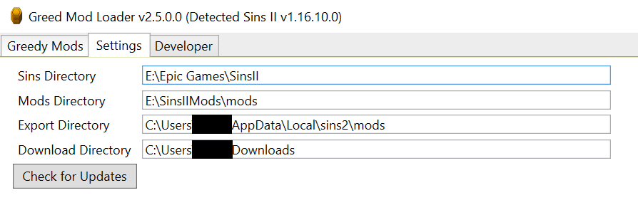

# The Greed Mod Manager

_A mod loader for [Sins of a Solar Empire II](https://www.sinsofasolarempire2.com/)_

| [GitHub](https://github.com/VoltCruelerz/Greed) | [Forum](https://forums.sinsofasolarempire2.com/522050/page/1) | [Discord](https://discord.com/channels/266693357093257216/1146234939315069008/1146234939315069008) |
|:------:|:-----:|:-------:|


## Table of Contents

- [The Greed Mod Manager](#the-greed-mod-manager)
    - [Table of Contents](#table-of-contents)
    - [Why Use Greed?](#why-use-greed)
    - [User Guide](#user-guide)
        - [Greed Setup](#greed-setup)
            - [Greed Installation](#greed-installation)
            - [Greed Configuration](#greed-configuration)
        - [Basic Use](#basic-use)
            - [Install a Mod](#install-a-mod)
                - [Online Catalog (Recommended)](#online-catalog-recommended)
                - [Drag-and-Drop](#drag-and-drop)
                - [Manual Install](#manual-install)
            - [Activate a Mod](#activate-a-mod)
        - [Left Pane - Mods](#left-pane---mods)
        - [Center Pane - Details \& Execution](#center-pane---details--execution)
        - [Right Pane - Difference](#right-pane---difference)
    - [Greedy Mod Development](#greedy-mod-development)
        - [Why Develop Greedy Mods?](#why-develop-greedy-mods)
        - [Merge Types](#merge-types)
            - [Greed Merge Extensions](#greed-merge-extensions)
            - [Null Removal](#null-removal)
        - [Greed Object Schema](#greed-object-schema)
        - [Greed Compatibility](#greed-compatibility)
    - [Contributing to Greed](#contributing-to-greed)
        - [Bug Reports](#bug-reports)
    - [Contributing Mods](#contributing-mods)
    - [Wishlist](#wishlist)

## Why Use Greed?

- **No More Manual Deconfliction**: File deconfliction happens automatically for you.
- **Automated Installation**: You can automatically install mods and their dependencies from an online catalog.
- **Drag-and-Drop Installation**: If you find a mod from some other source, you can drag-and-drop it into Greed to install it.
- **Conflict Detection**: You are warned if you try to enable mods with a known conflict between them.
- **Dependency Management**: You are warned if you attempt to enable a mod without its dependencies active.
- **Mod Packs**: Easily create bundles of your favorite mods that you can quickly enable together.
- **C Drive Offloading**: keep your inactive mods away from your limited-space C drive

## User Guide

### Greed Setup

#### Greed Installation

1. Download the `Greed.X.Y.Z.zip` from the [latest github release](https://github.com/VoltCruelerz/Greed/releases)
2. Extract the file wherever you please on your machine.
3. Run `Greed.exe`

#### Greed Configuration



Set the directories on the Settings tab. They will autosave if the paths exist.

- **Sins Directory**: the location of Sins II's exe. (eg `C:\Program Files\Epic Games\SinsII`)
- **Mods Directory**: where on your machine you wish to save your horde of mods, including the inactive ones. (eg `C:\Users\YOUR_USER\AppData\Local\sins2\mods`)
- **Export Directory**: regardless of where you choose to store your horde of mods, Sins II expects active mods to be in a particular folder, which will nearly always be `C:\Users\YOUR_USER\AppData\Local\sins2\mods`.
- **Downloads Directory**: the location where Greed is free to download mods to temporarily before extracting them to your mods directory. (eg `C:\Users\YOUR_USER\Downloads`)
- **Channel Catalog**: allows you to download mods from other installation channels. For users, this should be left on `Live`.

### Basic Use

#### Install a Mod

##### Online Catalog (Recommended)


1. Press the `[☁️]` button to view the online catalog.
2. Right click on whatever mod you want to install.
3. Install the version of your choice.

##### Drag-and-Drop

https://github.com/VoltCruelerz/Greed/assets/4068550/a0d3662e-25e5-46c2-ba97-54bf3adcfc63

##### Manual Install

1. Download the mod from GitHub, ModDB, or wherever else.
    1. If needed, unzip it.
2. Deposit it in `C:\Users\YOUR_USER\AppData\Local\sins2\mods` (change the path to use your Windows username).
    1. If the mod's name is `example-mod`, you should be able to find `greed.json` at `C:\Users\YOUR_USER\AppData\Local\sins2\mods\example-mod\greed.json`
3. Press the Refresh button to see the new mod appear in the list.

#### Activate a Mod

1. In the left pane, double click any desired installed mods to activate them.
2. In the center pane, press `[Export Greedy Mods]` to export the selected mods.
    1. After export completes, you will be prompted to start the game.

### Left Pane - Mods

> _The left pane shows the list of mods and allows you to modify how they are loaded._


1. Select an existing mod pack to activate.
2. Save the current list of active mods as a mod pack.
3. Delete the current mod pack.
4. Copy the configuration of the active mod pack to the clipboard.
5. Open the online mod catalog.
6. Refresh the list of mods from disk. (F5)
7. Import a mod pack configuration from the clipboard and install any missing mods.
8. Search field to filter installed mods.
9. Toggle _all_ mods.
10. Filter to active mods
11. List of mods. Drag and drop to change load order.
    1. Double-click to toggle a mod.
    2. Right-click to install alternate versions or uninstall a mod.
12. The installed version of the mod. If the online catalog contains an update, it will be denoted here.
13. The minimum required version of Greed to use this mod. If your Greed version is insufficient or if Greed is not backwards compatible with the mod, it will be marked here.
14. The minimum required verison of Sins to use this mod. If a mod requires a newer version of Sins than you have, it will be marked here.

### Center Pane - Details & Execution

> _The center pane contains details about a mod selected in the left pane, as well as execution tools._


1. The mod name, version, and required Sins version.
2. Author
3. The repository location for the mod.
4. A short description of the mod.
5. Greed automatically parses the README.md file of any mod you have and displays it here.
6. Exports the list of active mods for execution. (F6)
7. Run the game.

### Right Pane - Difference

> _The right pane shows the json file details of the selected mod, so you can see exactly what the mod does. This is mostly for developers._


1. Whether a mod is new or changed.
2. The folder of the modified file (eg `entities` or `uniforms`).
3. The name of the file.
4. View a comparison between what this file's contents and the original Sins version. You can also double click on a file to see its diff.

## Greedy Mod Development

### Why Develop Greedy Mods?

- **Selective Inclusion**: Your mod only needs to include what you changed about a particular source file (eg add a new property, delete a property, or add an array element), _drastically_ reducing the risk of collisions between mods.
- **Patch Merge**: Intelligent merging of files, allowing automated merge even within the same file.
- **Dependency Autoinstall**: Users can automatically install your mod's dependencies.
- **Automated Updates**: Users can update to the latest version of your mod automatically.
- **Comments**: You can add C-style comments to your source files.
- **Reduced Boilerplate**: Fractional files reduces the effort required to make small mods
- **Improved Exposure**: Greed comes with a catalog of online mods that can be automatically installed.
- **File Diff**: Greed ships with a diff tool specifically for Sins II data files, allowing you to readily see exactly what you've done.


### Merge Types

The ultimate goal of Greed is to allow multiple mods to gracefully integrate together so that we can release smaller, more targeted mods, rather than these massive bundles that nobody really knows what's inside them. To facilitate this, Greed acts as an arbiter, compiling greedy mods into a single "mod" in the mods directory which is then listed as active for Sins II to read from.

Ideally, a mod should change **_as little as it can_** to have its desired effect so that multiple mods could even modify the same file.

#### Greed Merge Extensions

To that end, Greed introduces several json file extensions that allow targeted edits within a given file. For example, if you want to edit the Kol, you might name your file `trader_battle_capital_ship.unit.gmr`.

- `.gmr` **(Greed Merge Replace)**: for each element in the the mod file's arrays, it replaces the greed file's corresponding element at that index, per **Newtonsoft**'s `MergeArrayHandling.Replace`.
    - eg `[1, 2, 3]` + `[4, 5]` = `[4, 5, 3]`
    - [Example](https://github.com/VoltCruelerz/constituent-components/blob/master/entities/trader_heavy_gauss_slugs.unit_item.gmr) removing an element from an array
- `.gmc` **(Greed Merge Concatenate)**: for each element in the mod's array, it concatenates them onto the original array, per **Newtonsoft**'s `MergeArrayHandling.Concat`.
    - eg `[1, 2]` + `[2, 3]` = `[1, 2, 2, 3]`
    - [Example](https://github.com/VoltCruelerz/constituent-components/blob/master/entities/buff.entity_manifest.gmc) of adding elements to an entity_manifest
- `.gmu` **(Greed Merge Union)**: for each element in the mod's array that does not already exist in the original array, add it to the end of the array, per **Newtonsoft**'s `MergeArrayHandling.Union`.
    - eg `[1, 2]` + `[2, 3]` = `[1, 2, 3]`
    - [Example](https://github.com/VoltCruelerz/constituent-components/blob/master/entities/trader_antimatter_engine_unit_item.ability.gmu) of adding autocast

In all of these cases, if you leave an object's field undefined, it will not be edited. So, if you wanted to edit just one of the many arrays in a `.player` file to add a new ship type, you'd only declare the one array you want to edit, and you'd probably do it in a `.gmu` file so you can add what you want to what's already there without redeclaring everything or worrying about another mod colliding with yours.

#### Null Removal

- If a field within your mod is null (not undefined, but actually `null`), it will **delete** that field from the greed file under construction. 
    - This applies regardless of whether you are using a `.gm*` file type or not.
- If inside an array in a `*.gmr`, it will delete the element at that original index from an array.
    - For example, in the array `[ 1, 2, 3, 4 ]`, if you want to remove the middle two elements, your mod would have `[ 1, null, null ]`, which would result in `[ 1, 4 ]`.

[Example](https://github.com/VoltCruelerz/constituent-components/blob/master/entities/trader_reserve_squadron_hangar.unit_item.gmr) removing a field from an item

> _**Note**: be very careful when removing elements by index that you know **_exactly_** what is there already._

### Greed Object Schema

Inside source files, you can have a top-level object to define additional rules, as seen [here](https://github.com/VoltCruelerz/capital-starts/blob/main/entities/vasari_rebel_battle.player.gmr).

```json
{
    "greed": {
        "parent": "vasari_rebel"
    }
}
```

| Field | Type | Description | Default Value |
|:------|:-----|:------------|:--------------|
| `parent` | `string` | The file name of the file you wish to inherit from. A file with a parent will prefer to initialize from the parent file instead of from its own the gold file (if one even exists). The parent can be a gold file, a file created by your mod, or a file created by another mod. It must be in the same directory with the same type. For example, the above was in a `.player` file in the `entities/` directory, so the parent file should be as well. | `null` |
| `mutations` | `mutation[]` | _This feature is WIP and will be documented once complete._ | `[]` |

### Greed Compatibility

To make a mod compatible with Greed, you need only add a `greed.json` file to your mod's folder, as seen below.

```json
{
    "name": "Your Mod",
    "author": "Your Name",
    "url": "https://github.com/YourName/your-mod",
    "description": "Blurb goes here.",
    "version": "1.0.0",
    "sinsVersion": "1.15.1.0",
    "greedVersion": "1.7.2",
    "dependencies": [
        {
            "id": "other-mod",
            "version": "1.0.0"
        }
    ],
    "predecessors": [
        "pred-mod"
    ]
    "conflicts": ["conflicting-mod"],
    "isTotalConversion": false
}
```

While I recommend you take advantage of Greed's more powerful features like merge file extensions, merely adding the above will make any mod interactible for Greed.

| Field | Type | Description |
|:------|:-----|:------------|
| `name`* | `string` | The human-readable name of your mod |
| `author`* | `string` | Who you are. |
| `description`* | `string` | A brief summary of your mod. Save details for the readme. |
| `url`* | `url` | The URL to your thread or repo where you give greater details about your mod. Details beyond what is covered in the description should be covered here. |
| `version`* | `version` | The version of the mod itself. |
| `sinsVersion`* | `version` | The minimum compatible Sins version. |
| `greedVersion`* | `version` | The minimum compatible Greed version. |
| `dependencies`* | `dependency[]` | An array of dependencies that are REQUIRED for this mod to function. |
| `predecessors`* | `string[]` | An array of mods that if this is co-active with SHOULD be loaded first. |
| `conflicts`* | `string[]` | An array of mod ids with which this mod is incompatible. |
| `isTotalConversion` | `bool` | Whether or not the mod should presume conflicts in the absence of dependencies. (default `false`) |

## Contributing to Greed

I welcome contributions. Just open a pull request.

If at some point in the future, I can no longer maintain Greed, it's MIT licensed.

### Bug Reports

In the event of an error, consult the log (viewable both in the textbox at the bottom of the frame and also in `log.txt`, found in whatever directory you've got Greed in).

- If the error appears to be one with Greed itself, please [create a GitHub issue](https://github.com/VoltCruelerz/Greed/issues/new).
    - Be sure to use an appropriate label and include the log when submitting so I can hunt down the error easier.
- Otherwise, contact the appropriate mod developer.

## Contributing Mods

To contribute a mod to the online catalog, open a merge request [here](https://github.com/League-of-Greedy-Modders/Greedy-Mods).

## Wishlist

> **NOTE**: The following items are things that may or _may not_ make it in.

- **Remove-by-query**: right now, Greed struggles with (the admittedly uncommon) task of removing specific array elements without overwriting the entire array.
- **Inheritance**: allow a file to inherit from another file, eg a new faction might inherit from an existing `.player` file it is similar to, so you don't have to redefine _everything_.
- **Soft Prerequisites**: mod A does not require mod B, but if they are both active, mod B needs to be loaded first.
